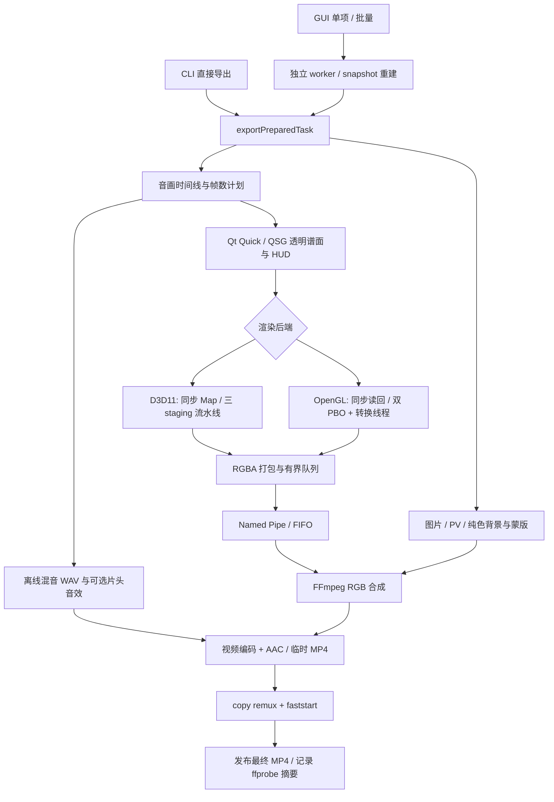

# 视频导出静态审计报告

审计日期：2026-09-13。代码基线：`5397039df5aba71d5cdbeb16c8ae044390442a85`。

范围：当前 MiaCode **谱面预览视频导出**的 GUI 单项、GUI 批量、CLI、内部 worker，以及它们共享的场景、读回、传输、合成、编码和输出链路。封面 PNG、谱面打包 ZIP、已有 PV 的压缩工具不是这条视频生成链路。这里的“所有分支”按独立决策维度列出，实际一次导出是这些分支的组合。

方法：阅读当前实现、调用点、相关 Spec 和少量历史记录，并核对 FFmpeg/OpenGL/D3D11 的相关接口契约。未修改产品代码，未构建或执行导出，未进行 GPU 故障注入，也没有把工作区现有 `output.mp4` 当作用户提供的故障样本。截图作为症状材料；代码注释及历史文档作为线索，不作为已复现的证据。

结论先行：正常链路按帧号离线推进，没有“机器慢就主动跳帧”的调度策略；但**流水线读回失败转同步时会丢失尚未交付的帧**，这是当前代码可确认的条件性缺陷。运动边缘噪点优先考虑有损编码与色度采样；OpenGL 快速读回也有与单帧横带撕裂相关的历史线索。截图不足以确认具体机器、版本、编码器和根因。

证据标记：**确定**＝代码直接证明的行为或缺口；**候选**＝机制与症状相容，尚需故障样本验证；**历史**＝当前注释记录的问题，不能证明当前版本仍复现。优先级表示调查或修复顺序，不表示发生概率。

## 第一部分：目前的导出链路分支及触发条件

### 1. 入口与进程边界

| 分支 | 触发条件与调用链 | 关键位置 |
|---|---|---|
| GUI 单项 | 导出页非 batch 页签点击导出；`ExportSession::startExport → ExportEngine::launchVideoExport → VideoExportHost` 构建 snapshot，再启动独立 worker；通过 JSON 回报进度及结果 | [ExportSession.cpp:729](/Users/caoyusen/Desktop/MiaCode/src/app/ui/export/ExportSession.cpp:729)、[单项启动:842](/Users/caoyusen/Desktop/MiaCode/src/app/ui/export/ExportSession.cpp:842)、[ExportWorker.cpp:768](/Users/caoyusen/Desktop/MiaCode/src/app/runtime/export/ExportWorker.cpp:768) |
| GUI 批量 | `activeTab == batch`；对目录×选中难度生成任务，逐个 snapshot、逐个 `runVideoExportWorkerSync`；不是多个视频并发生成。目录/谱面/音乐缺失等计为该项失败，继续其他项；取消终止批量 | [ExportSession.cpp:734](/Users/caoyusen/Desktop/MiaCode/src/app/ui/export/ExportSession.cpp:734)、[ExportFlow.cpp:619](/Users/caoyusen/Desktop/MiaCode/src/app/runtime/export/ExportFlow.cpp:619)、[逐项执行:660](/Users/caoyusen/Desktop/MiaCode/src/app/runtime/export/ExportFlow.cpp:660) |
| CLI 直接导出 | `--export-video`；创建应用服务、加载谱面及皮肤，`exportPreviewVideoFromCli → exportFullPreview → exportPreparedTask`。在 CLI 自己的进程内执行，不经过 GUI 的 worker 重试包装 | [cli_video_export.cpp:347](/Users/caoyusen/Desktop/MiaCode/src/app/cli_video_export.cpp:347)、[ExportSnapshot.cpp:1121](/Users/caoyusen/Desktop/MiaCode/src/app/runtime/export/ExportSnapshot.cpp:1121)、[VideoExportController.cpp:71](/Users/caoyusen/Desktop/MiaCode/src/tools/video_export/VideoExportController.cpp:71) |
| 内部 worker | `--export-video-worker`，stdin 接收 `start_export` JSON；反序列化 snapshot、重建 task，然后进入同一个 `exportPreparedTask` | [cli_video_export_worker.cpp:116](/Users/caoyusen/Desktop/MiaCode/src/app/cli_video_export_worker.cpp:116)、[重建及执行:152](/Users/caoyusen/Desktop/MiaCode/src/app/cli_video_export_worker.cpp:152)、[VideoExportSnapshot.cpp:439](/Users/caoyusen/Desktop/MiaCode/src/tools/video_export/VideoExportSnapshot.cpp:439) |
| worker 崩溃重试 | 仅 GUI 单项/批量包装：`CrashExit && 本次请求PBO && 未取消 && 已完成尝试次数 <= 1`，重启整个 worker，注入 `MIACODE_EXPORT_DISABLE_OFFSCREEN_PBO=1`。最多重试一次 | [VideoExportRuntimePolicy.cpp:89](/Users/caoyusen/Desktop/MiaCode/src/tools/video_export/VideoExportRuntimePolicy.cpp:89)、[批量重试:706](/Users/caoyusen/Desktop/MiaCode/src/app/runtime/export/ExportWorker.cpp:706)、[单项重试:1004](/Users/caoyusen/Desktop/MiaCode/src/app/runtime/export/ExportWorker.cpp:1004) |

重试判断取的是环境配置的“请求 PBO”，不是 worker 实际启用的读回模式；因此 OpenGL 高质量实际已同步读回，仍可能符合一次重试条件。普通返回失败、FFmpeg 子进程失败、画面错误但进程正常退出，不触发这项崩溃重试。

### 2. 公共数据流

QSG 导出层集合明确去掉 `StageBackgroundLayer`，保留外圈、轨迹、运动星星、note、判定及其他按设置显示的层；HUD 和可选片头一起渲染。**PV/普通背景图片由外部 FFmpeg 读取合成**，不走预览播放器的实时视频帧桥接。[图层掩码](/Users/caoyusen/Desktop/MiaCode/src/core/scene/PreviewLayerOrder.h:46)、[导出场景装配](/Users/caoyusen/Desktop/MiaCode/src/tools/video_export/VideoExportQuickRenderBackend.cpp:91)

### 3. 时间线、帧数与片头分支

| 分支 | 当前行为 | 位置 |
|---|---|---|
| 从零附近开始 | GUI `exportStartSeconds <= 0.01` 归为 full-range，CLI 使用 `<= 1e-6`；此名称不要求导出到谱面末尾 | [GUI 判断](/Users/caoyusen/Desktop/MiaCode/src/tools/video_export/VideoExportSettings.cpp:213)、[CLI 判断](/Users/caoyusen/Desktop/MiaCode/src/app/runtime/export/ExportSnapshot.cpp:1050) |
| full-range，无片头 | 2 秒 lead-in；谱面时间在负时间窗口连续推进到起点，不画暂停图标 | [AudioRenderPlan.cpp:235](/Users/caoyusen/Desktop/MiaCode/src/tools/video_export/VideoExportAudioRenderPlan.cpp:235)、[逐帧时间:2011](/Users/caoyusen/Desktop/MiaCode/src/tools/video_export/VideoExportPreparedTask.cpp:2011) |
| 部分范围 | 1.5 秒 preload，谱面、HUD、PV 冻结在段落起点，音频静止，覆盖暂停图标；之后推进 | [VideoExportConfig.h:8](/Users/caoyusen/Desktop/MiaCode/src/common/VideoExportConfig.h:8)、[时间映射:2027](/Users/caoyusen/Desktop/MiaCode/src/tools/video_export/VideoExportPreparedTask.cpp:2027)、[暂停图标:1565](/Users/caoyusen/Desktop/MiaCode/src/tools/video_export/VideoExportPreparedTask.cpp:1565) |
| maimai 片头 | `task.intro.enabled && fullRangeExport`，额外增加 `349/60 ≈ 5.817` 秒，再接 2 秒 lead-in；QML 按输出帧映射到 60fps 整数创作帧；HUD 隐藏至片头揭开，背景最后 1 秒淡入 | [IntroConfig.h](/Users/caoyusen/Desktop/MiaCode/src/common/IntroConfig.h:14)、[初始化:994](/Users/caoyusen/Desktop/MiaCode/src/tools/video_export/VideoExportPreparedTask.cpp:994)、[背景淡入:784](/Users/caoyusen/Desktop/MiaCode/src/tools/video_export/VideoExportPreparedTask.cpp:784) |
| 片头视觉初始化失败 | 不显示片头，继续导出；之前生成的音频/帧数计划仍保留片头时长 | [VideoExportPreparedTask.cpp:1003](/Users/caoyusen/Desktop/MiaCode/src/tools/video_export/VideoExportPreparedTask.cpp:1003) |
| 批量 | snapshot 强制完整范围；保留用户片头偏好 | [ExportSnapshot.cpp:863](/Users/caoyusen/Desktop/MiaCode/src/app/runtime/export/ExportSnapshot.cpp:863)、[ExportSession.cpp:768](/Users/caoyusen/Desktop/MiaCode/src/app/ui/export/ExportSession.cpp:768) |
| 开发预览截短 | `previewMaxOutputSeconds > 0`：截短视频生产帧数，保留原音频计划，添加 `-shortest` | [VideoExportPreparedTask.cpp:273](/Users/caoyusen/Desktop/MiaCode/src/tools/video_export/VideoExportPreparedTask.cpp:273)、[截短音频:1161](/Users/caoyusen/Desktop/MiaCode/src/tools/video_export/VideoExportPreparedTask.cpp:1161) |

总帧数为 `max(1, round((片头 + lead-in/preload + 内容时长) * fps))`，对齐总时长为 `frameCount/fps`。循环严格取 `outputSecond = frameIndex/fps`。GUI 提供 30/60/120fps、10 档分辨率；CLI 接受正整数 fps，底层检查正尺寸、宽≥高及正时长，没有按设备性能自动降低 fps。[帧数计划](/Users/caoyusen/Desktop/MiaCode/src/tools/video_export/VideoExportAudioRenderPlan.cpp:249)、[预设列表](/Users/caoyusen/Desktop/MiaCode/src/tools/video_export/VideoExportSettings.h:19)、[底层校验](/Users/caoyusen/Desktop/MiaCode/src/tools/video_export/VideoExportPreparedTask.cpp:226)

### 4. 渲染后端与读回分支

**后端选择先于读回选择，编码器选择与它们独立。** 硬件编码不等于 D3D11 渲染，软件编码也不等于 CPU 绘图。

| 条件 | 后端 |
|---|---|
| Windows；`MIACODE_EXPORT_RENDER_BACKEND` 未设置、`d3d11_qrhi`、`d3d11` 或 `auto`；进程图形 API 为 D3D11 | 尝试 D3D11/QRhi QQuickRenderControl |
| 显式 `opengl`，或者上述变量其他未知值 | OpenGL QQuickRenderControl |
| macOS/Linux | OpenGL；没有本条导出链路的 Metal/Vulkan session |
| D3D11 不适用或初始化失败 | 回退 OpenGL；例如非 D3D11 进程、software GPU 策略、设备/资源创建失败 |
| OpenGL 也初始化失败 | 导出失败；没有可工作的 QPainter 全谱面 CPU 降级路径 |

入口依据：[DebugOptions.h:536](/Users/caoyusen/Desktop/MiaCode/src/common/DebugOptions.h:536)、[main.cpp:461](/Users/caoyusen/Desktop/MiaCode/src/app/main.cpp:461)、[VideoExportPreparedTask.cpp:926](/Users/caoyusen/Desktop/MiaCode/src/tools/video_export/VideoExportPreparedTask.cpp:926)。D3D11 使用 GPU policy 的适配器 LUID；查找失败回到系统默认硬件适配器；显式 feature-level 列表失败后不指定列表再试，仍失败才退出。[设备策略及创建](/Users/caoyusen/Desktop/MiaCode/src/preview/runtime/PreviewQuickD3D11ExportSession.cpp:310)

读回开关优先级：`MIACODE_EXPORT_DISABLE_OFFSCREEN_PBO=true` 优先；其次 `MIACODE_EXPORT_ENABLE_OFFSCREEN_PBO` 的显式布尔值；都不设则请求开启。另有 `MIACODE_EXPORT_DISABLE_PBO_READBACK=1` 硬关闭。随后应用以下条件，并进行能力探测。[策略](/Users/caoyusen/Desktop/MiaCode/src/tools/video_export/VideoExportRuntimePolicy.cpp:65)、[应用点](/Users/caoyusen/Desktop/MiaCode/src/tools/video_export/VideoExportPreparedTask.cpp:1033)

| 实际后端与质量 | 默认读回 | 关闭或不支持流水线时 |
|---|---|---|
| OpenGL + HighQuality | 同步 `glReadPixels` 到 CPU buffer | 同左；enable PBO 也不能越过质量条件 |
| OpenGL + Fast | 两个 PBO 交替读回，加一个 CPU 转换线程；稳态延迟两帧 | 同步 `glReadPixels` |
| D3D11 + HighQuality | 三个 staging texture，保留两帧后按 FIFO `Map` 转换 | `CopyResource → Map` 同步 |
| D3D11 + Fast | 同上 | 同步 Map，仍可保留预乘 alpha |

OpenGL 探测包含版本/扩展、函数入口和 buffer/map smoke test；D3D11 要求 staging ring 已建立。[GL 探测](/Users/caoyusen/Desktop/MiaCode/src/preview/runtime/PreviewQuickExportSession.cpp:396)、[D3D11 探测](/Users/caoyusen/Desktop/MiaCode/src/preview/runtime/PreviewQuickD3D11ExportSession.cpp:501)

运行中流水线 step 返回失败时，当前帧切同步；它并不重新初始化为另一种图形 API。同步返回空图则失败。正常结束会 drain pending 队列；drain 失败直接终止。[step 与回退](/Users/caoyusen/Desktop/MiaCode/src/tools/video_export/VideoExportFrameRender.cpp:398)、[末尾 drain](/Users/caoyusen/Desktop/MiaCode/src/tools/video_export/VideoExportPreparedTask.cpp:2133)

`MIACODE_EXPORT_ENABLE_GPU_RENDER=0` 当前只影响请求/日志字段，没有真正绕开强制 Quick 初始化。`renderOverlayFrame()` 也是调用 offscreen 渲染，`usedGpuRendererLastFrameForDebug()` 固定 true、CPU fallback count 固定 0。不要把保留的 `cpu_fallback`、`fallback=cpu` 字样误认作有效导出分支。[配置](/Users/caoyusen/Desktop/MiaCode/src/tools/video_export/VideoExportEncoder.cpp:239)、[包装器](/Users/caoyusen/Desktop/MiaCode/src/tools/video_export/VideoExportQuickRenderBackend.cpp:388)、[固定诊断值](/Users/caoyusen/Desktop/MiaCode/src/tools/video_export/VideoExportQuickRenderBackend.cpp:452)

### 5. RGBA、缓冲区及管道分支

| 分支 | 条件与行为 | 位置 |
|---|---|---|
| straight RGBA | 全部 OpenGL；D3D11 HighQuality；D3D11 Fast 显式关闭预乘管道。8bit 预乘读回转换成 `RGBA8888`，GL 同时上下翻转，D3D 按 RowPitch 从上向下读取 | [GL 转换](/Users/caoyusen/Desktop/MiaCode/src/preview/runtime/PreviewQuickExportSession.cpp:762)、[D3D 转换](/Users/caoyusen/Desktop/MiaCode/src/preview/runtime/PreviewQuickD3D11ExportSession.cpp:58) |
| premultiplied RGBA | 仅 D3D11 + Fast + `MIACODE_EXPORT_PREMULTIPLIED_PIPE` 未设或 true；输出格式为 `RGBA8888_Premultiplied`，FFmpeg 对应 `alpha=premultiplied` | [策略](/Users/caoyusen/Desktop/MiaCode/src/tools/video_export/VideoExportRuntimePolicy.cpp:80)、[应用](/Users/caoyusen/Desktop/MiaCode/src/tools/video_export/VideoExportPreparedTask.cpp:988)、[最终 overlay](/Users/caoyusen/Desktop/MiaCode/src/tools/video_export/VideoExportPreparedTask.cpp:1115) |
| 打包 | 格式不匹配先转换；stride 等于 `width*4` 则直接引用，否则逐行拷贝排除 padding | [VideoExportFrameRender.cpp:735](/Users/caoyusen/Desktop/MiaCode/src/tools/video_export/VideoExportFrameRender.cpp:735) |
| 首帧 | 始终深拷贝入队（已有 packing scratch 时直接移交 scratch） | [VideoExportPreparedTask.cpp:1745](/Users/caoyusen/Desktop/MiaCode/src/tools/video_export/VideoExportPreparedTask.cpp:1745) |
| 后续帧 | 紧密 stride 的 QImage 零拷贝移交队列，packet 保存 `frameOwner` 维持生命周期；否则移交 packing scratch | [RawVideoPipeTransport.cpp:520](/Users/caoyusen/Desktop/MiaCode/src/tools/video_export/RawVideoPipeTransport.cpp:520) |
| 平台传输 | Windows Named Pipe；macOS/Linux FIFO。单 writer 线程按 FIFO 整帧顺序写，处理短写；队列满则等待，不淘汰旧帧 | [创建](/Users/caoyusen/Desktop/MiaCode/src/tools/video_export/RawVideoPipeTransport.cpp:346)、[完整写入](/Users/caoyusen/Desktop/MiaCode/src/tools/video_export/RawVideoPipeTransport.cpp:154)、[背压](/Users/caoyusen/Desktop/MiaCode/src/tools/video_export/RawVideoPipeTransport.cpp:431) |

这里没有当前可达的“FFmpeg stdin 视频”或“先写整段 raw 文件再编码”生产分支：stdin 用于 worker 命令；实际视频通过 Named Pipe/FIFO。`writeAllToProcess` 等旧 helper 的存在不代表主链路使用它。raw dump 是诊断旁路。

### 6. 背景、蒙版和合成分支

素材选择：优先接受 snapshot 提供的有效 `backgroundMediaPath`；否则按 chart assets 规则查找背景；`UltraCompact` 禁用视频背景，仍可选择图片。图片后缀是 jpg/jpeg/png/bmp/webp。[选择点](/Users/caoyusen/Desktop/MiaCode/src/tools/video_export/VideoExportPreparedTask.cpp:287)、[图片判别](/Users/caoyusen/Desktop/MiaCode/src/tools/video_export/VideoExportPipeline.cpp:163)

| 分支 | 触发条件与行为 | 位置 |
|---|---|---|
| 无背景 | `hasMedia=false`，纯色 `#1F2833` | [base_fill](/Users/caoyusen/Desktop/MiaCode/src/tools/video_export/VideoExportPreparedTask.cpp:632) |
| 图片 | 先用 QImage/QPainter 一次性按最终尺寸与缩放模式生成 staged PNG；成功后 FFmpeg 循环该 PNG；失败则循环原图并交给 FFmpeg 做缩放 | [预处理](/Users/caoyusen/Desktop/MiaCode/src/tools/video_export/VideoExportPreparedTask.cpp:379)、[stage 实现](/Users/caoyusen/Desktop/MiaCode/src/tools/video_export/VideoExportFrameRender.cpp:643) |
| 视频 PV | FFmpeg 直接打开文件；该命令未设置 `-hwaccel`，不使用 GUI 的 QtAVPlayer/D3D11VA 解码桥；`fps=task.fps`、裁剪和时间戳调整后叠加 | [输入](/Users/caoyusen/Desktop/MiaCode/src/tools/video_export/VideoExportPreparedTask.cpp:536)、[filter](/Users/caoyusen/Desktop/MiaCode/src/tools/video_export/VideoExportPreparedTask.cpp:641) |
| FitContain | 保持比例缩放后补黑边 | [模式分派](/Users/caoyusen/Desktop/MiaCode/src/tools/video_export/VideoExportPreparedTask.cpp:717) |
| SquareFitContain | 放入居中正方形区域，补边 | 同上 |
| Fill / 默认 | 保持比例放大后裁剪铺满输出 | 同上 |
| InnerCircleFitOuterFill | 外层铺满，内层等比完整显示，圆形 mask + alphamerge 再合成；图片 staged 成功时此工作已一次性完成，不再进入双视频 filter | [条件](/Users/caoyusen/Desktop/MiaCode/src/tools/video_export/VideoExportPreparedTask.cpp:532)、[双路](/Users/caoyusen/Desktop/MiaCode/src/tools/video_export/VideoExportPreparedTask.cpp:670) |
| 亮度遮罩 | 内或外亮度<1 时生成 dim PNG，按 smoothBrightness 选择平滑过渡；否则直通 | [条件与生成](/Users/caoyusen/Desktop/MiaCode/src/tools/video_export/VideoExportPreparedTask.cpp:523)、[合成](/Users/caoyusen/Desktop/MiaCode/src/tools/video_export/VideoExportPreparedTask.cpp:755) |

视频媒体时间线另外有四类：图片不加时序 filter；部分范围先 trim 并用 `tpad=start_mode=clone` 冻结段首；正 origin trim 后归零；负 origin 延后首帧；视频结尾统一 `tpad=stop_mode=clone` 延长。原视频帧率不足会重复采样，帧率过高会舍弃部分 PV 帧；这不意味着谱面层丢帧。[MediaTimeline.cpp:25](/Users/caoyusen/Desktop/MiaCode/src/tools/video_export/VideoExportMediaTimeline.cpp:25)

主合成保持 `format=rgb` 并显式指定 alpha 模式；片头 fade 后有 `format=rgb24` 令 base 不透明。最后才输出 4:2:0。普通背景不随 QSG 的纹理缓存变化。[合成及 alpha](/Users/caoyusen/Desktop/MiaCode/src/tools/video_export/VideoExportPreparedTask.cpp:784)

### 7. 音频分支

编译包含 `MIACODE_HAS_BASS_AUDIO` 时选择 BASS 离线混音；BASS 不支持或渲染失败就终止，并不会运行时改选 Legacy。没有该编译宏才选择 Legacy 混音。[VideoExportPipeline.cpp:173](/Users/caoyusen/Desktop/MiaCode/src/tools/video_export/VideoExportPipeline.cpp:173)

二者都先生成 WAV，再让 FFmpeg 编成 AAC。BGM 按文件是否存在决定启用；note SFX、touch-hold、可选 clock 按计划调度。部分范围的前 1.5 秒不推进音频。片头音效优先外部资源，复制失败保留静音前垫；成功时另一路输入 `amix=normalize=0:duration=first`。音频不充当视频逐帧的实时主时钟。[音频计划](/Users/caoyusen/Desktop/MiaCode/src/tools/video_export/VideoExportAudioRenderPlan.cpp:279)、[片头音效](/Users/caoyusen/Desktop/MiaCode/src/tools/video_export/VideoExportPreparedTask.cpp:472)、[amix](/Users/caoyusen/Desktop/MiaCode/src/tools/video_export/VideoExportPreparedTask.cpp:797)

### 8. 编码器选择：完整决策顺序

FFmpeg 路径先用 `MIACODE_FFMPEG_PATH`（未设时用 `MIACODE_FFMPEG`），然后应用目录、应用 ffmpeg 子目录、Resources、仓库第三方目录、Homebrew/本地目录，最后 PATH。ffprobe 先同目录，后 PATH。不同机器实际可能调用不同 FFmpeg 构建。[查找顺序](/Users/caoyusen/Desktop/MiaCode/src/tools/video_export/VideoExportEncoder.cpp:571)

先运行 `ffmpeg -encoders` 获取可用名称，再决定候选顺序：

| 决策 | 条件 | 结果 |
|---|---|---|
| 强制编码器 | `MIACODE_EXPORT_FORCE_ENCODER` 非空 | 名称在支持名单及 FFmpeg 列表中则直接返回，**跳过运行探测**；不可用或拼错回退 mpeg4，不改走完整 auto 列表 |
| compatibility 模式 | `MIACODE_EXPORT_ENCODER_MODE=compatibility/software/safe` | 软件候选优先；仍有后续硬件候选，不是绝对禁止硬件 |
| hardware 模式 | `hardware/hardware_preferred/fast` | 硬件候选优先，并把 HEVC 硬件候选加入列表 |
| 默认 balanced + Fast | 质量预设为 Fast | 硬件优先，但不因此加入 HEVC |
| 默认 balanced + HighQuality，macOS/Linux | 平台规则 | 硬件优先 |
| 默认 balanced + HighQuality，Windows | `W*H*fps >= 180M`；或 `>=120M 且线程数<=8`；或有效可用内存 `0<MiB<=4096 且 >=100M` | 满足任意一项硬件优先；否则软件优先 |

依据：[模式与环境](/Users/caoyusen/Desktop/MiaCode/src/tools/video_export/VideoExportEncoder.cpp:206)、[自动偏好](/Users/caoyusen/Desktop/MiaCode/src/tools/video_export/VideoExportEncoder.cpp:298)、[强制选择](/Users/caoyusen/Desktop/MiaCode/src/tools/video_export/VideoExportEncoder.cpp:1086)

候选列表具体顺序（仅加入当前 FFmpeg 声明支持的项）：

1. 软件组：`libx264 → libopenh264`。
2. H.264 硬件组：macOS 的 `h264_videotoolbox → h264_vaapi → h264_nvenc → h264_qsv → h264_amf（Linux排除） → h264_mf`。VAAPI 还须存在 render node。
3. 仅 hardware 模式再附加 HEVC 硬件组：同样次序的 `hevc_*`；没有 auto `libx265` 分支。
4. 两组依前述软/硬偏好拼接；`mpeg4` 存在或候选为空时放末尾。硬件优先的自动模式会把 QSettings 记住的上次成功硬件编码器挪至最前。
5. 默认只对硬件候选执行运行探测；失败试下一项，遇到软件候选直接接受。`MIACODE_EXPORT_SKIP_ENCODER_RUNTIME_PROBE` 开启则直接选第一项。最终兜底为 mpeg4。

硬件探测只有 6–12 个黑色视频帧，尺寸缩放限制在 1920×1080 内，超时 6 秒；不验证实际复杂谱面、高分辨率、长时编码的可靠性。正式编码启动/中途失败后，没有换编码器重跑整个视频的逻辑。[候选排列](/Users/caoyusen/Desktop/MiaCode/src/tools/video_export/VideoExportEncoder.cpp:948)、[缓存置顶](/Users/caoyusen/Desktop/MiaCode/src/tools/video_export/VideoExportEncoder.cpp:1071)、[探测](/Users/caoyusen/Desktop/MiaCode/src/tools/video_export/VideoExportEncoder.cpp:665)、[选择循环](/Users/caoyusen/Desktop/MiaCode/src/tools/video_export/VideoExportEncoder.cpp:1129)

### 9. 编码质量、体积与像素格式分支

两个用户维度相互叠加：`HighQuality/Fast` 与 `Standard/Compact/UltraCompactWithPv/UltraCompact`。结构默认 HighQuality、Standard；GUI 的保存偏好与 snapshot 可覆盖。当前直接 CLI 没有质量/体积参数，其 task 构建也未覆盖这两项，因此保持 HighQuality + Standard；不能仅靠 CLI 的 enable-PBO 环境开关复现 GUI Fast 的 OpenGL 路径。[默认值](/Users/caoyusen/Desktop/MiaCode/src/tools/video_export/VideoExportController.h:199)

令 `P=W*H*fps`，下表目标码率单位为 kbps：

| 体积 / 质量 | 目标码率 | 峰值、buffer 与 GOP | x264 默认 CRF |
|---|---|---|---|
| Standard + Fast | clamp(round(P×0.075/1000), 2200, 8500) | 峰值约1.4倍，上限10500；buffer约峰值2倍，上限16000；GOP 2秒 | 22 |
| Standard + HighQuality | clamp(round(P×0.090/1000), 2600, 10500) | 峰值约1.35倍，上限14000；buffer约峰值1.75倍，上限20000；GOP 2秒 | 20 |
| Compact | clamp(round(P×0.070/1000), 1800, 8000) | 峰值1.35倍，buffer峰值2倍，GOP 4秒 | Fast 23 / HQ 21 |
| UltraCompactWithPv | 固定4000 | 峰值4000，buffer8000，GOP 6秒；保留 PV | Fast 25 / HQ 23 |
| UltraCompact | 固定4000 | 同上；禁用 PV、允许图片 | Fast 25 / HQ 23 |

**上表的目标码率不是所有编码器都以同一方式使用：**

- `libx264` Standard 只用 CRF/preset/bframes/tune，不使用该表的码率上限；非 Standard 同时附加 bitrate/maxrate/bufsize。
- x264 Fast 默认 `veryfast, crf=22, bf=0, tune=animation`；HQ 默认 CRF20、bf0，preset 按内存、线程数与像素率调整，再作 faster→fast、fast→medium 的调整。环境 `MIACODE_EXPORT_X264_PRESET/CRF/BFRAMES` 最后覆盖；CRF 限16–28，B帧限0–8。
- 硬件编码器使用共享码率参数；H.264 显式 bf0，HEVC 不显式约束 bf。VideoToolbox 增加 `-allow_sw 0`；VAAPI 需要 `format=nv12,hwupload`；`h264_mf` 在非 Standard 增加 `pc_vbr/archive`。
- `libopenh264` 只设置目标 `-b:v`，Standard HQ 再乘1.1；不带共享 maxrate/bufsize。`mpeg4` Standard 为 `-q:v 3（HQ）/4（Fast）`，非 Standard 用共享码率参数。编码器枚举进程启动失败的特殊兜底直接用 mpeg4 q3/q4。

依据：[码率公式](/Users/caoyusen/Desktop/MiaCode/src/tools/video_export/VideoExportEncoder.cpp:376)、[体积策略](/Users/caoyusen/Desktop/MiaCode/src/tools/video_export/VideoExportRuntimePolicy.cpp:5)、[x264 调参](/Users/caoyusen/Desktop/MiaCode/src/tools/video_export/VideoExportEncoder.cpp:445)、[各编码器实参](/Users/caoyusen/Desktop/MiaCode/src/tools/video_export/VideoExportEncoder.cpp:838)

所有正式导出使用 `-fps_mode cfr -r fps -frames:v frameCount`；普通编码显式 `yuv420p`，VAAPI 上传 NV12，同属8bit 4:2:0。没有用户可选的无损/RGB/4:4:4/10bit 输出链路。音频 AAC 请求码率再受体积档上限320/160/128/128约束。[最终参数](/Users/caoyusen/Desktop/MiaCode/src/tools/video_export/VideoExportPreparedTask.cpp:1130)

软件编码线程默认 CPU 线程数、限1–32；filter 默认软件限1–8、硬件限2–4，环境可覆盖至软件16/硬件4。线程数改变生产耗时，不改变逐帧时间线。[线程计划](/Users/caoyusen/Desktop/MiaCode/src/tools/video_export/VideoExportPreparedTask.cpp:854)

### 10. 结束、诊断与非生产旁路

先写临时 `encoded_raw.mp4`；writer drain 完成、FFmpeg 正常退出且 code0 后，第二次 FFmpeg `-c copy -movflags +faststart` 生成同目录 stage 文件，然后替换最终路径。后一步是封装复制，不重新有损编码。[编码结束](/Users/caoyusen/Desktop/MiaCode/src/tools/video_export/VideoExportPreparedTask.cpp:2308)、[remux](/Users/caoyusen/Desktop/MiaCode/src/tools/video_export/VideoExportPreparedTask.cpp:2399)、[发布](/Users/caoyusen/Desktop/MiaCode/src/tools/video_export/VideoExportPreparedTask.cpp:2467)

校验/素材/混音/初始化/写管道/编码/remux/发布失败均有失败出口；取消通过 GUI 停止 worker，底层有 callback 的调用者也可取消。不能把中途失败的临时文件与正常发布 MP4 混为一谈。

诊断分支：`MIACODE_EXPORT_DIAG_REPEAT` 控制完整帧重复与可选物件参考渲染；`DIAG_OBJECT_HASH` 默认值虽 true，但受前者总开关约束；`DIAG_OBJECT_TRACE` 跟踪物件；`DIAG_PIPE_HASH` 与 `DIAG_RAW_DUMP_PATH` 可记录编码前 RGBA。`DIAG_COMPARE_RENDER_PATHS` 当前仅记录 `ignored=1 reason=legacy_path_removed`，并不执行新旧渲染对比。[配置](/Users/caoyusen/Desktop/MiaCode/src/tools/video_export/VideoExportEncoder.cpp:250)、[实际 gate](/Users/caoyusen/Desktop/MiaCode/src/tools/video_export/VideoExportPreparedTask.cpp:1227)、[禁用对比](/Users/caoyusen/Desktop/MiaCode/src/tools/video_export/VideoExportPreparedTask.cpp:1368)

## 第二部分：问题的可能归因与代码位置

### 1. 优先级概览

| 编号 | 对应症状 | 结论与证据强度 | 优先级 |
|---|---|---|---|
| R1 | 突然跳帧、之后音画错位、末尾重复 | 流水线失败转同步遗漏 pending 帧；**确定的条件性缺陷** | P1 |
| R2 | 导出“成功”但有遗漏或重复 | 没有逐帧序号守恒和内容校验，FFmpeg 可把缺帧隐藏成完整帧数；**确定的验收缺口** | P1 |
| R3 | 单帧图片/轨迹横带撕裂 | OpenGL Fast PBO/驱动读回；**历史 + 当前风险候选** | P1 调查 |
| R4 | 旧帧重复、局部随机像素 | GL 读回命令错误未检查，buffer 内容可能继续进入编码；**确定的检查缺口，发生待验证** | P2 |
| R5 | 沿运动轮廓的噪点、蚊噪、暗色晕边 | 有损量化、码率限制和4:2:0；**首要画质候选** | P1 调查 |
| R6 | 边缘闪烁、细线断续、缩小旋转时锯齿 | 无 mipmap、有限超采样、单采样目标及8bit alpha；**次要画质候选** | P2 |
| R7 | 首帧部分轮廓缺失 | 零拷贝首帧历史问题已有深拷贝规避；**历史，不能扩展成任意帧已知缺陷** | P2 调查 |
| R8 | 特定部分画面低帧率、段首冻结 | 片头60fps整数采样、PV帧率转换、1.5秒preload；**确定的设计行为** | 解释性 |
| R9 | 片段起点附近长物件缺失、素材似乎中断 | 仅按 marker.second 过滤，没有按持续可见区间相交；**确定过滤行为，症状依赖谱面** | P2 |
| R10 | 低性能设备更易遇到问题 | 固定约半 GiB 视频队列、GPU/编码竞争与探测不足；**确定负载因素，不能单独证明丢帧** | P2 |

### 2. R1：流水线失败回退时遗漏尚未交付帧

**触发前提：已成功积累 pending 帧，后续 `renderOverlayFrameOffscreenPboStep` 返回 false，而同步重画当前帧又成功。** OpenGL Fast 与 D3D11 两档的流水线都进入这段公共处理。

证据链：

1. 正常返回时，前一帧像素与 `pendingPboFrames.front()` 配对出队，并把本次帧号入队。[VideoExportFrameRender.cpp:414](/Users/caoyusen/Desktop/MiaCode/src/tools/video_export/VideoExportFrameRender.cpp:414)
2. 出错后直接 reset 后端、把 `useOffscreenPboReadback=false`，没有 drain 或重画旧 pending，也没有把它们补回输出。[同文件:445](/Users/caoyusen/Desktop/MiaCode/src/tools/video_export/VideoExportFrameRender.cpp:445)
3. 随即同步渲染**当前** frameIndex 并交付。[同文件:455](/Users/caoyusen/Desktop/MiaCode/src/tools/video_export/VideoExportFrameRender.cpp:455)
4. 末尾仅在 `useOffscreenPboReadback` 仍 true 时 drain，所以遗留队列此后不再交付。[VideoExportPreparedTask.cpp:2133](/Users/caoyusen/Desktop/MiaCode/src/tools/video_export/VideoExportPreparedTask.cpp:2133)

例：已经输出0…97，pending为98、99；提交100时 step失败。代码可能直接输出100、101…，98、99永久遗漏。稳态通常缺两帧；120fps约16.7ms，60fps约33.3ms，30fps约66.7ms。错误出现在更早阶段时遗漏数可更少。

pipe 中只传像素字节，packet 的 frameIndex 没有进入 rawvideo 协议。因而 FFmpeg 将“内容为100的帧”当成第98帧，后续谱面内容相对于保持原时间线的背景/音频提前；不是留下两个可自动恢复的时间戳空洞。[pipe writer](/Users/caoyusen/Desktop/MiaCode/src/tools/video_export/RawVideoPipeTransport.cpp:275)、[rawvideo 输入](/Users/caoyusen/Desktop/MiaCode/src/tools/video_export/VideoExportPreparedTask.cpp:512)

低性能设备更容易发生内存/GPU错误只是候选诱因；不能从静态代码证明这段回退在用户机器上已触发。应检查 `render_backend_fallback ... reason=offscreen_pbo_failed`，再对照故障帧附近输出内容。只见 `pbo_fence_wait_failed` 不等于发生了这项回退。

### 3. R2：缺帧可被末帧延长掩盖，成功判定不验证内容

FFmpeg 最终 overlay 的主输入是有完整时长的 base，谱面是第二输入；没有设置 `repeatlast=0` 或 `shortest=1`。FFmpeg framesync 默认会延长第二输入最后一帧。因此 R1 少送帧后，可能仍产出指定数量的 MP4 帧，代价是末尾重复和中途时间错位。这个推论依赖实际 FFmpeg 构建按该契约运行。[最终 overlay](/Users/caoyusen/Desktop/MiaCode/src/tools/video_export/VideoExportPreparedTask.cpp:1121)、[FFmpeg framesync 文档](https://ffmpeg.org/ffmpeg-filters.html#Options-for-filters-with-several-inputs-framesync)

writer 不检查 frameIndex 连续性，也不核对总写帧数等于计划数；`finishRawVideoPipePump` 仅检查已有 failureDetail。最终 ffprobe 摘要只记日志，不据其判断 success，更没有解码后内容比对。[writer](/Users/caoyusen/Desktop/MiaCode/src/tools/video_export/RawVideoPipeTransport.cpp:235)、[结束](/Users/caoyusen/Desktop/MiaCode/src/tools/video_export/RawVideoPipeTransport.cpp:614)、[无条件成功点](/Users/caoyusen/Desktop/MiaCode/src/tools/video_export/VideoExportPreparedTask.cpp:2485)

**所以 `avg_frame_rate=60`、`nb_frames` 正确、导出显示成功，都不能排除物件内容跳帧。** 修复验收需要生产帧号/写入帧号守恒，并检查实际内容时间；单看容器帧数不够。

### 4. R3：OpenGL PBO 撕裂线索及其边界

当前 Fast GL 分支是 `render → glReadPixels(FBO→PBO) → fence → map旧PBO → memcpy → CPU转换线程`。代码注释记录在某些 GL 驱动中出现横向带状撕裂，甚至 fence 未报告失败时仍出现；HQ 因而默认禁用 GL PBO。[质量分支及历史说明](/Users/caoyusen/Desktop/MiaCode/src/tools/video_export/VideoExportPreparedTask.cpp:1019)、[实际 pipeline](/Users/caoyusen/Desktop/MiaCode/src/preview/runtime/PreviewQuickExportSession.cpp:556)

当前已存在以下保护，不能忽略：每个 PBO 放 fence；Map 前等待；映射后先拷贝到 CPU staging，再 Unmap；转换线程完成后才允许复用 staging；转换输出独立拥有像素。[fence/Map](/Users/caoyusen/Desktop/MiaCode/src/preview/runtime/PreviewQuickExportSession.cpp:973)、[线程交接](/Users/caoyusen/Desktop/MiaCode/src/preview/runtime/PreviewQuickExportSession.cpp:1016)、[等待](/Users/caoyusen/Desktop/MiaCode/src/preview/runtime/PreviewQuickExportSession.cpp:1033)

剩余风险是 fence 超过2秒或 WAIT_FAILED 后仅记录日志，继续 Map，且没有把整帧标为可疑或重画。**但这不能直接证明读取了“GPU尚未写完”的内存**：当前使用 `GL_MAP_READ_BIT`，没有 `GL_MAP_UNSYNCHRONIZED_BIT`；按 OpenGL 契约，Map 本身应等待该 buffer 的 pending 操作完成。因此更准确的归因是“特定驱动/Qt RHI 组合下的历史兼容性问题，显式同步失败后降回隐式同步”，不是 API 层面必然的数据竞争。[Khronos Map 契约](https://raw.githubusercontent.com/KhronosGroup/OpenGL-Refpages/main/gl4/glMapBufferRange.xml)

对应“素材某一帧被横向切开”较为相容，尤其故障像素已存在于编码前 RGBA 时。若故障出在当前 Windows 默认 D3D11 导出、且没有回退 OpenGL 的日志，这条归因不适用。

D3D11 当前 `Map(...D3D11_MAP_READ, flags=0)`，随后按 RowPitch 转换到拥有内存的 QImage，最后 Unmap；三 staging slot 是 FIFO 复用。没有发现正常路径中显式非阻塞 Map 或忽略 RowPitch 的确定性缺陷。不能仅因“没有独立 fence”就判为异步撕裂。[D3D11实现](/Users/caoyusen/Desktop/MiaCode/src/preview/runtime/PreviewQuickD3D11ExportSession.cpp:635)、[Microsoft Map 契约](https://learn.microsoft.com/en-us/windows/win32/api/d3d11/nf-d3d11-id3d11devicecontext-map)

### 5. R4：OpenGL 读回成功的检查不足

同步 `glReadPixels` 和 PBO `glReadPixels` 后都没有检查 GL error；PBO buffer 分配也没有逐项确认 `glBufferData` 成功。能力 smoke test 不覆盖之后每一次全尺寸分配和读回。[同步读回](/Users/caoyusen/Desktop/MiaCode/src/preview/runtime/PreviewQuickExportSession.cpp:366)、[PBO读回](/Users/caoyusen/Desktop/MiaCode/src/preview/runtime/PreviewQuickExportSession.cpp:643)、[PBO分配](/Users/caoyusen/Desktop/MiaCode/src/preview/runtime/PreviewQuickExportSession.cpp:1083)

如果一次读回未成功写入，但之后 CPU buffer/Map/图像转换仍成功，就可能把旧数据或无效数据当作当前帧；表现可为重复帧或局部异常。当前返回 true 的依据不足以证明 GPU 实际写出了完整的新一帧。这里确认的是检查缺口，不是已证明用户遇到 GL error。

另外，读回依赖 Qt renderControl 结束后的当前 framebuffer binding，读前没有显式绑定/核验 read framebuffer；单独的自建 FBO 只在清屏时 bind，随后 release。这属于 Qt/RHI 状态契约依赖，需结合实际 Qt 版本/GL 状态验证，不能据此直接判定“读错 FBO”。[清屏与render](/Users/caoyusen/Desktop/MiaCode/src/preview/runtime/PreviewQuickExportSession.cpp:1173)

### 6. R5：运动轮廓噪点的首要候选——压缩与色度采样

截图中暗色背景上的细亮曲线、白色边框、黄色高饱和物件，是检查有损边缘失真的重点区域。MP4 编码不能保留任意细节；当前没有无损选项，最终强制8bit 4:2:0。色度空间分辨率下降可造成彩色边缘模糊或偏移，有损量化/预测可在运动轮廓附近产生噪点、暗晕或残留。截图本身不能区分编码失真与已被编码保留下来的渲染错误。

具体风险来源：

- Standard 硬件 Fast/HQ 的目标码率分别封顶8.5/10.5Mbps；2560×1440@120 等输出增大后，目标不再按像素率增加。Ultra 两档不论分辨率或 fps 均固定4Mbps。高速小物件会提高细节保持难度。[码率策略](/Users/caoyusen/Desktop/MiaCode/src/tools/video_export/VideoExportEncoder.cpp:388)
- 同一个 HQ 选项在不同设备可能走 x264 CRF20，也可能走受限码率硬件编码，不能理解为跨设备像素一致。弱设备的 CPU/内存阈值恰好会改变硬件优先级。[自动策略](/Users/caoyusen/Desktop/MiaCode/src/tools/video_export/VideoExportEncoder.cpp:347)
- Compact/Ultra 同时提高 x264 CRF 并引入码率约束；长 GOP 是压缩策略，不等同于应用丢帧。它不能凭自身解释整齐的横向几何撕裂。[体积策略](/Users/caoyusen/Desktop/MiaCode/src/tools/video_export/VideoExportRuntimePolicy.cpp:5)
- 代码记录过 x264 bf3 时暗色 ringing 的历史，当前默认已设 bf0；只有显式 BFRAMES 覆盖等情况才会重新偏离这个默认。不能写成“当前默认 B 帧就是噪点根因”，也不能泛化为所有 B 帧必然损害画质。[历史及默认](/Users/caoyusen/Desktop/MiaCode/src/tools/video_export/VideoExportControllerInternal.h:121)、[最终覆盖](/Users/caoyusen/Desktop/MiaCode/src/tools/video_export/VideoExportEncoder.cpp:552)

验证分界：编码前透明 RGBA 干净、最终 MP4 有噪点，优先查 FFmpeg 合成/转换/编码；若编码前已出现同形状缺陷，优先查场景或读回。进一步用同一份 raw 帧做无损 RGB 合成参考，可以区分合成错误和有损编码。

### 7. R6：纹理采样、几何抗锯齿与 alpha 精度

纹理缓存当前不请求 mipmap，注释说明曾因 Intel 驱动 GenerateMips 崩溃撤回。Sprite 使用 Linear filtering；shader 以 `fwidth(uv)` 作4点平均补偿缩小采样，但不是完整 mip 链或足够高样本重建。note 从极小尺寸出现、旋转或高速经过像素网格时，细线/透明边缘仍可能闪烁。[PreviewTextureRepository.cpp:145](/Users/caoyusen/Desktop/MiaCode/src/preview/quick_scene/PreviewTextureRepository.cpp:145)、[Linear](/Users/caoyusen/Desktop/MiaCode/src/preview/quick_scene/PreviewQuickSpriteNodes.cpp:415)、[4点采样](/Users/caoyusen/Desktop/MiaCode/src/preview/quick_scene/shaders/PreviewSpriteMaterial.frag:22)

GL FBO 未请求多重采样，D3D11 目标明确 `SampleDesc.Count=1`。这不意味着所有图像完全没有抗锯齿，但裁剪边缘/几何边缘缺少额外 MSAA 覆盖。[GL目标](/Users/caoyusen/Desktop/MiaCode/src/preview/runtime/PreviewQuickExportSession.cpp:712)、[D3D目标](/Users/caoyusen/Desktop/MiaCode/src/preview/runtime/PreviewQuickD3D11ExportSession.cpp:702)

Straight 管道对8bit预乘颜色执行反预乘；低 alpha 的整数舍入会改变边缘 RGB。重新按 alpha 合成会压低这类误差，不能据此解释严重整块断裂。D3D Fast 预乘模式减少这一步量化。当前打包格式与 FFmpeg alpha 参数已成对选择，没有发现全局“把预乘当 straight”的必现错误。[GL反预乘](/Users/caoyusen/Desktop/MiaCode/src/preview/runtime/PreviewQuickExportSession.cpp:828)、[格式与overlay](/Users/caoyusen/Desktop/MiaCode/src/tools/video_export/VideoExportPreparedTask.cpp:1115)

4点采样没有携带 sourceRect 边界进行额外 clamp；若素材裁切边界附近有其他内容，存在越过逻辑采样区域的候选风险。但当前不能凭此认定 Qt atlas 串色：普通纹理创建没有显式 TextureCanUseAtlas 请求，且 UV 使用 texture 的正规转换接口。[sourceRect](/Users/caoyusen/Desktop/MiaCode/src/preview/quick_scene/PreviewQuickSpriteNodes.cpp:60)

这组候选主要解释细边缘随位置变化的闪烁，而不是背景整张图片突然横向错位。

### 8. R7：零拷贝与纹理生命周期——已有保护及仍需定位的历史问题

当前注释记录首帧顶部约250×26区域损坏，轮廓贡献在 writer 读数据时缺失，真实原因未定位。现有处理只对 frame0 深拷贝。它是与“素材某帧断裂”直接相关的历史证据，但不能当作29秒附近缺陷的已知原因。[历史与规避](/Users/caoyusen/Desktop/MiaCode/src/tools/video_export/VideoExportPreparedTask.cpp:1712)

后续帧 packet 持有 QImage owner，GL/D3D转换器在输出仍共享时显式分配新 QImage，避免覆盖 writer 正在读取的像素；GL PBO 线程也先 wait 再复用 staging。静态检查未发现正常路径上明确的悬空 pointer 或无条件覆写在途帧。[packet owner](/Users/caoyusen/Desktop/MiaCode/src/tools/video_export/RawVideoPipeTransport.cpp:547)、[GL独占检查](/Users/caoyusen/Desktop/MiaCode/src/preview/runtime/PreviewQuickExportSession.cpp:790)、[D3D独占检查](/Users/caoyusen/Desktop/MiaCode/src/preview/runtime/PreviewQuickD3D11ExportSession.cpp:88)

纹理缓存超限会重建整个 texture generation，删除节点与纹理有配套生命周期；sprite 顶点更新标记 DirtyGeometry，空余顶点做退化填充。这削弱了“缓存删了纹理但活节点继续引用”或“上帧多余三角形必然残留”的简单解释。[generation重建](/Users/caoyusen/Desktop/MiaCode/src/preview/quick_scene/PreviewQuickSceneRoot.cpp:959)、[顶点更新](/Users/caoyusen/Desktop/MiaCode/src/preview/quick_scene/PreviewQuickSpriteNodes.cpp:293)

若故障恰逢 `texture_generation_reset`、新特效首次出现、或者只在零拷贝时复现，这些位置仍应成为定点检查范围。当前不能从历史注释断言首帧规避已解决所有驱动上的同类问题。

### 9. R8：看起来掉帧、但来自明确采样或冻结设计的情况

- **片段开头1.5秒冻结**是预设行为，有暂停图标。完整范围和CLI接近零的阈值不同，0.001–0.01秒附近会走不同分支，应避免把这一入口差异误判为性能故障。
- **120fps导出中的片头最多60fps内容更新**：`authoringFrameForOutputFrame` 四舍五入到整数60fps帧号，120fps相邻输出帧常映射到同一创作帧。谱面主体继续按120fps推进。[IntroConfig.h:48](/Users/caoyusen/Desktop/MiaCode/src/common/IntroConfig.h:48)
- **PV原始低帧率/VFR、PV结尾停留**：`fps=` 转成输出帧率，`tpad` 明确克隆末帧。要分别检查背景和谱面运动；不能用整画面“有重复”直接判应用漏送帧。[PV滤镜](/Users/caoyusen/Desktop/MiaCode/src/tools/video_export/VideoExportPreparedTask.cpp:734)
- **播放器掉帧**仍是一种候选：输出高分辨率、高fps或强制HEVC时，低性能播放设备可能不能实时解码/呈现；静态导出代码不能排除。若逐帧解码内容完整而实时播放卡顿，原因应转向播放端。FFmpeg 的 CFR 只保证请求的时间格，不能证明播放器每帧都呈现。[CFR契约](https://ffmpeg.org/ffmpeg.html#Advanced-Video-options)

### 10. R9：只按物件起始时间过滤，可能遗漏跨范围长物件

`filteredMarkersForRange` 只保留 `timelineOrigin <= marker.second <= segmentEnd`，随后该集合同时用于渲染和音效计划；没有使用 holdEnd、slideEnd、availableSecond 等持续可见区间作相交判断。[过滤实现](/Users/caoyusen/Desktop/MiaCode/src/tools/video_export/VideoExportAudioRenderPlan.cpp:28)、[传入窗口](/Users/caoyusen/Desktop/MiaCode/src/tools/video_export/VideoExportAudioRenderPlan.cpp:261)

例如从30秒导出，partial origin约28.5秒；一个28秒开始、32秒结束的长物件会被整体剔除，即使它在30秒仍应可见。结束后判定落在范围外、但接近片尾已开始入场的对象也需核对。此类问题表现为部分对象缺失或连续性不符，不是随机像素噪点，也不是帧管道少传一帧。

### 11. R10：低性能相关性来自负载和分支选择，而非正常循环追赶时钟

视频队列帧数是：

`2 × clamp(round(32 × 1920 × 1080 / (W×H)), 8, 128)`。

这不查询可用内存。1920×1080为64帧，RGBA约506MiB；2560×1440为36帧，也约506MiB；1024²为126帧，约504MiB。加上在写帧、读回、GPU staging、纹理缓存、FFmpeg/PV解码和混音内存，弱设备可承受明显压力。窗口队列本身仍采用阻塞背压，不丢帧。[队列公式](/Users/caoyusen/Desktop/MiaCode/src/tools/video_export/RawVideoPipeTransport.cpp:314)

性能压力可使导出更慢、出现资源失败、触发R1回退或worker崩溃；不能把 `overBudgetRenderFrames`、`overBudgetWriteFrames` 当作丢帧计数，它们只是耗时超过1/fps的统计。[统计点](/Users/caoyusen/Desktop/MiaCode/src/tools/video_export/VideoExportPreparedTask.cpp:1834)

弱设备还会改变自动编码器偏好，短黑帧探测也可能超时，导致同一设置选择不同codec。正式导出没有对复杂画面长时负载的质量/连续性预检。[硬件启发式](/Users/caoyusen/Desktop/MiaCode/src/tools/video_export/VideoExportEncoder.cpp:347)、[短探测](/Users/caoyusen/Desktop/MiaCode/src/tools/video_export/VideoExportEncoder.cpp:676)

### 12. 额外边界缺陷与故障解释限制

**OpenGL PBO仅导出1帧时的drain边界**：第一次提交只留下pending PBO，没有转换线程输出；第一次drain把PBO送入转换线程，返回true但 `completedFrameReady=false`；外层 `drainPendingExportFrame` 将此判失败。这是底层接口可构造的边界（直接提供 Fast task 并截短到1帧）；当前公开 CLI 保持 HighQuality，GUI 常规带lead-in输出也远多于1帧，所以不能把它当成普通 CLI/GUI 已可复现的生产缺陷。它导致导出失败，不会解释正常长视频中间的噪点。[GL drain](/Users/caoyusen/Desktop/MiaCode/src/preview/runtime/PreviewQuickExportSession.cpp:605)、[外层判失败](/Users/caoyusen/Desktop/MiaCode/src/tools/video_export/VideoExportFrameRender.cpp:521)

**同时开启多个独立导出进程时的临时目录互删**：每个进程初始化 registry 会删除 temp 根目录中所有 `miacode-video-export-*`，没有存活PID/锁校验。单个GUI批量是串行，不必然触发；多实例/多CLI并发时可能删除别人的WAV、staged PNG或FIFO。这更像读取失败、卡住或导出失败，不应首先归因为用户截图中的轻微蚊噪。[清理实现](/Users/caoyusen/Desktop/MiaCode/src/tools/video_export/VideoExportPreparedTask.cpp:147)

**不宜作为主归因的说法**：

- “慢机器来不及渲染，所以主动追帧丢掉中间帧”：正常循环和背压不支持此说法。
- “默认启用了B帧，所以运动噪点必然出现”：当前H.264/x264默认bf0。
- “D3D staging ring存在就必然撕裂”：Map、RowPitch和独占输出均有处理。
- “QSG没有清屏导致轨迹一直留在背景”：GL有显式清屏，Quick窗口透明目标也由renderControl渲染；静态未发现正常路径确定的跨帧残留逻辑。
- “faststart二次压缩导致画质下降”：当前为stream copy。
- “GUI预览播放器的实时掉帧就是导出掉帧”：导出PV和谱面均有独立离线路径。

### 13. 用现有诊断进一步确定归因的最短路径

以下是后续验证建议，本次未执行，不作为本报告的复现实验结果。

1. 从同次导出的 `export_begin / render_backend / premultiplied_pipe / encoder_select / ffmpeg_encode_args` 确认版本、模式、实际codec、读回方式、尺寸/fps、FFmpeg路径。检查 `render_backend_fallback`、`pbo_fence_wait_failed`、worker重试及纹理generation日志。
2. 用 `MIACODE_EXPORT_DIAG_RAW_DUMP_PATH` 留存**编码前谱面透明层**；必要时开启 `DIAG_PIPE_HASH` 和 `DIAG_REPEAT/DIAG_OBJECT_TRACE`。raw dump不含普通背景/PV，D3D Fast dump仍是预乘，检查时必须按同一alpha语义合成。[dump点](/Users/caoyusen/Desktop/MiaCode/src/tools/video_export/VideoExportPreparedTask.cpp:1689)
3. raw已有横带/断裂：在保持同一encoder/尺寸/fps时，仅关闭流水线读回，定位R3/R4/R7；raw本身干净但最终视频不干净：在同一份raw上比较无损RGB合成和有损4:2:0，定位R5或FFmpeg媒体/合成。
4. 怀疑掉帧：对比实际物件位移和输出帧号，而不是只看容器fps；针对R1在稳态第N帧注入一次step失败，验证pending帧、写入序号、末尾内容守恒。现有runtime policy Spec主要覆盖开关/重试决策，不能替代这类端到端故障恢复检查。
5. 对背景图片断裂与note素材断裂分开取样。普通staged背景是一次生成并循环读取；如果只有普通背景的某帧损坏，优先查FFmpeg编码/解码或播放端，QSG读回不是该背景像素的生产者。如果是片头QML里的封面图，则仍在QSG链路内。

本次静态结论最强的是R1及R2；对用户截图中的细轨迹周围噪点，R5优先、R6次之；对单帧横带撕裂，先用实际后端和raw样本决定是否进入R3/R4/R7。缺少原始故障视频、同次日志与历史版本号时，无法可靠地把两类症状统一归为一个根因。
